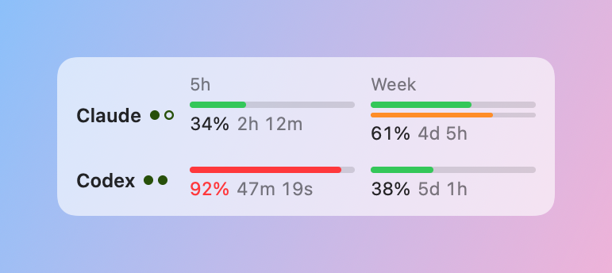
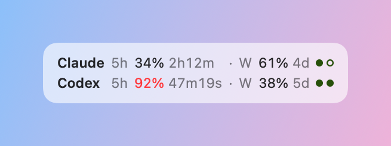
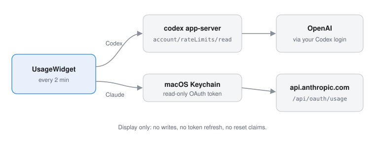
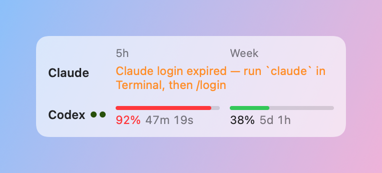
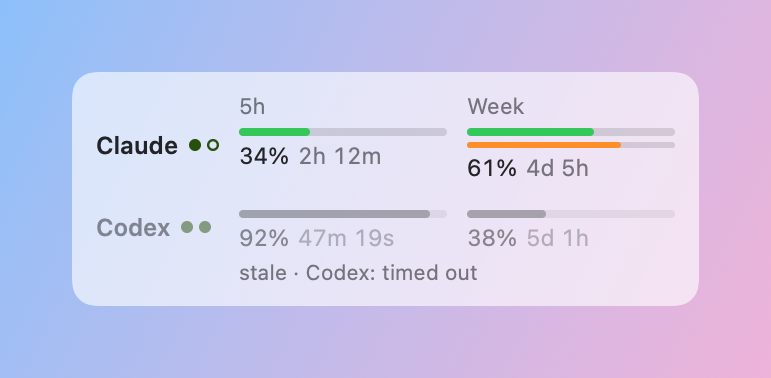

# UsageWidget

**English** · [繁體中文](README.zh-TW.md)

A tiny floating macOS widget that shows how much of your **Claude Code** and **Codex** usage
limits is left: the 5-hour window, the weekly window, Claude's separate Fable weekly limit, and
the one-time weekly-reset credits you have.

<picture>
  <source media="(prefers-color-scheme: dark)" srcset="docs/images/hero-dark.png">
  
</picture>

## Features

- **Floats** above your windows on every Space, stays out of the way of full-screen apps, and
  remembers where you dragged it.
- **5h and Week** for each provider: a thin bar plus `used % · time until reset` on one line.
  Hover a cell for the exact reset time.
- **Fable weekly** (Claude): a thinner bar under Claude's Week bar. Hover it for the numbers.
- **Reset credits**: one green dot per one-time weekly reset you own; hollow dots are paused
  credits. Hover for the soonest expiry.
- Bars turn **orange at 70 %** and **red at 90 %**.
- **Compact mode**: double-click the widget for one aligned line per provider.

  <picture>
    <source media="(prefers-color-scheme: dark)" srcset="docs/images/compact-dark.png">
    
  </picture>

- Refreshes every 2 minutes (and right after a window resets); countdowns tick every second.
- Menu bar item: Show/Hide, Refresh Now (⌘R), Compact Mode, Launch at Login, Quit.

## How it works



- **Codex**: runs your installed `codex app-server` and asks it for `account/rateLimits/read`
  over JSON-RPC. The process tree is cleaned up after every read.
- **Claude Code**: reads the OAuth token Claude Code stored in your Keychain
  (`Claude Code-credentials`, read-only) and calls Claude's usage endpoint on
  `api.anthropic.com`.

## Requirements

- macOS 14 or later
- Swift 6 toolchain (Xcode or the Command Line Tools) to build
- [Claude Code](https://docs.anthropic.com/en/docs/claude-code) signed in, for the Claude row
- [Codex CLI](https://github.com/openai/codex) signed in, for the Codex row
  (looked up in `/opt/homebrew/bin`, `/usr/local/bin` and `~/.local/bin`)

Either provider works on its own; the other row just shows an error line.

## Quick start

```sh
git clone https://github.com/davidshih/usage-remaining.git
cd usage-remaining
scripts/build-app.sh --install
open ~/Applications/UsageWidget.app
```

The first launch registers the app as a login item. Turn that off with **Launch at Login** in
the menu (macOS may ask you to approve it in System Settings → General → Login Items).

## Verify

```sh
swift test   # unit tests, offline
```

After `open ~/Applications/UsageWidget.app` you should see the widget in the top-right corner and
a gauge icon in the menu bar. **Refresh Now** (⌘R) fetches fresh numbers; compare them with
`/usage` in Claude Code and `/status` in Codex.

## States

| Login expired | Fetch failed |
|---|---|
|  |  |
| Claude's token expired: run `claude` in Terminal, then `/login`. The widget picks up the new token on its next refresh. | The last good numbers stay on screen, dimmed, with the reason underneath. |

## Privacy and security

- **Read-only.** The widget never writes to the Keychain, never refreshes your token (so it
  can't log Claude Code out) and never uses or claims a reset credit.
- **Your token goes only to `api.anthropic.com`.** Redirects are refused so it can't be
  forwarded anywhere else.
- **Nothing is logged or collected.** No analytics, no network calls other than the one usage
  request; Codex is queried locally through its own CLI.

## Disclaimer

This is an unofficial tool, not affiliated with or endorsed by Anthropic or OpenAI. It relies on
undocumented endpoints (`/api/oauth/usage` and `codex app-server`), which can change or break at
any time. Known limitation: Claude only reports reset credits to its own clients, so the Claude
row may show no dots even if your account has resets.

## Development

```sh
swift build
swift test
scripts/build-app.sh   # builds dist/UsageWidget.app without installing
```

Architecture, data formats and gotchas: [docs/reference/development.md](docs/reference/development.md).

## Uninstall

Turn off **Launch at Login**, quit from the menu, then:

```sh
rm -rf ~/Applications/UsageWidget.app
defaults delete com.davidshih.usagewidget
```

## License

[MIT](LICENSE)
